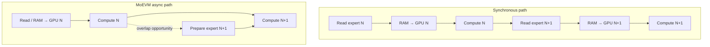

# Sync versus async paged-runtime smoke

This reference compares the default synchronous OLMoE paged runtime with the
opt-in MoEVM async expert pipeline. It uses three alternating-order pairs on the
same RTX 3080 Ti, model revision, prompt, teacher-forced token sequence, LRU32
cache capacity and two pinned staging slots.


Async used less wall time in all six comparisons while the fail-closed pair
gate required identical token identities and per-scope cache/transfer counters.
Peak allocated VRAM was also observed equal in all six runs.

| Dynamic expert-cache condition | Paired ratios, sync / async | Median ratio | Median paired time saved |
|---|---:|---:|---:|
| Empty | `1.274x`, `1.357x`, `1.263x` | **`1.274x`** | **21.5%** |
| Retained | `1.419x`, `1.398x`, `1.391x` | **`1.398x`** | **28.5%** |

The median is computed from the three paired ratios, not by dividing two
independently selected median times. Exact observations and raw-artifact hashes
are in [`result.json`](result.json).

## Why the pipeline can reduce waiting

The synchronous path finishes each data stage before starting expert compute.
The async path can prepare the next expert while the current expert is being
used. This is a scheduling diagram, not a measured profiler timeline:



One bounded storage worker, explicitly owned pinned staging buffers, a dedicated
CUDA H2D stream and per-slot readiness/use events provide that opportunity.
Demand accounting still occurs in the same logical order as sync, so lookahead
cannot protect future LRU entries or change the amount of work.

## Evidence boundary

This is deliberately a **provisional two-token smoke**, not a general serving
benchmark:

- one prompt, two teacher-forced tokens and one generation-equivalent decode
  interval per pass;
- three paired repetitions on one GPU, with no concurrent requests;
- "empty" refers to the runtime's dynamic GPU expert cache, not a flushed SSD,
  Windows page cache or device cache;
- safetensors remains mmap/page-cache backed, so logical storage bytes are not
  physical NVMe telemetry;
- no common CUDA-event timeline or profiler trace was captured, so lower wall
  time does not by itself prove physical NVMe overlap or H2D/kernel overlap.
- CPU, RAM, storage load, power, temperature and clock state were not captured
  contemporaneously for every pair.

The correct conclusion is narrow: **the async scheduling MVP produced a stable
positive wall-time signal in this controlled smoke without changing the
validated workload or memory budget.** Longer multi-workload and profiler runs
remain necessary before making a public production-performance claim.

## Reproduce and verify

Run sync and async in alternating order with identical arguments. The
benchmark report must come from a clean tree and records its Git commit and
script SHA-256. The following template reproduces the complete six-run protocol
after replacing the two local placeholders:

```powershell
$python = '.\.venv-real\Scripts\python.exe'
$snapshot = '<LOCAL_PINNED_SNAPSHOT>'
$reference = '<TWO_TOKEN_BASELINE_METADATA>'
$outputDir = '.\results\paged-async'
$env:PYTHONPATH = (Resolve-Path .\src).Path
New-Item -ItemType Directory -Force -Path $outputDir | Out-Null

function Invoke-PagedMode([int]$repetition, [string]$mode) {
  $output = Join-Path $outputDir "repetition-$repetition-$mode.json"
  & $python .\scripts\benchmark_paged_olmoe.py `
    --snapshot $snapshot `
    --workload-file .\benchmarks\workloads\olmoe_m1.json `
    --workload-id python_code `
    --reference-metadata $reference `
    --teacher-force-reference `
    --policy lru `
    --pipeline $mode `
    --slots-per-layer 32 `
    --staging-slots 2 `
    --max-input-tokens 64 `
    --max-new-tokens 2 `
    --seed 17 `
    --device cuda:0 `
    --output $output
  if ($LASTEXITCODE -ne 0) { throw "Benchmark failed: R$repetition $mode" }
}

try {
  Invoke-PagedMode 1 async
  Invoke-PagedMode 1 sync
  Invoke-PagedMode 2 sync
  Invoke-PagedMode 2 async
  Invoke-PagedMode 3 async
  Invoke-PagedMode 3 sync
} finally {
  Remove-Item Env:PYTHONPATH -ErrorAction SilentlyContinue
}
```

Validate each pair with:

```powershell
& '.\.venv-real\Scripts\python.exe' .\scripts\compare_paged_pipeline_pair.py `
  .\results\paged-async\repetition-1-sync.json `
  .\results\paged-async\repetition-1-async.json `
  --output .\results\paged-async\repetition-1-pair.json
```

Regenerate or verify the committed chart from the sanitized reference:

```powershell
.\.venv\Scripts\python.exe .\scripts\render_paged_async_reference.py
.\.venv\Scripts\python.exe .\scripts\render_paged_async_reference.py --check
```

Relevant sources:

- [full-model benchmark harness](../../../scripts/benchmark_paged_olmoe.py)
- [fail-closed pair comparator](../../../scripts/compare_paged_pipeline_pair.py)
- [deterministic SVG renderer](../../../scripts/render_paged_async_reference.py)
- [pinned workload collection](../../workloads/olmoe_m1.json)
