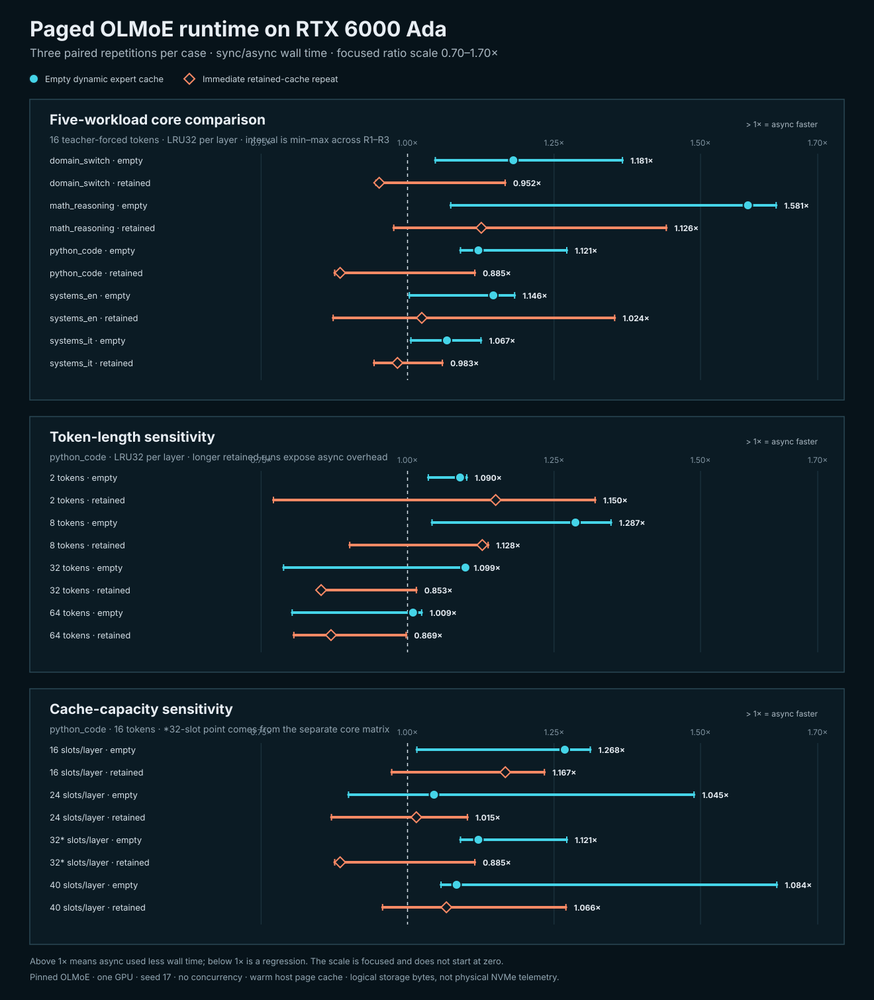

# RTX 6000 Ada paged-runtime study

This reference records 36 paired sync-versus-async comparisons of the MoEVM
paged OLMoE runtime on one NVIDIA RTX 6000 Ada Generation GPU. Every pair
passed the repository comparator's exact token, source, cache, traffic,
memory-budget and failure-counter gates.



## Result

The result is useful, but mixed. Async scheduling was faster in 33 of 36
empty-dynamic-cache comparisons and 18 of 36 immediate retained-cache
comparisons. Across the five-workload core matrix, the median of the three
per-repetition aggregate ratios was:

| Cache condition | Median paired ratio | Median wall-time saving | Repetitions |
| --- | ---: | ---: | ---: |
| Empty dynamic expert cache | 1.208x | 17.24% | 3/3 faster |
| Immediate retained repeat | 1.057x | 5.41% | 2/3 faster |

`sync / async > 1` means async was faster. Ratios are computed within each
pair. The five-workload aggregate first sums wall time across workloads within
each repetition and then takes the median of the three paired ratios.

The long retained-cache cases identify the current limitation clearly:

| Python-code continuation | Empty-cache median | Retained median |
| ---: | ---: | ---: |
| 2 tokens | 1.090x | 1.150x |
| 8 tokens | 1.287x | 1.128x |
| 32 tokens | 1.099x | **0.853x** |
| 64 tokens | 1.009x | **0.869x** |

At 32 and 64 tokens, the current async path was about 15% and 13% slower on
the retained repeat. This is evidence for keeping async opt-in and developing
an adaptive policy; it is not evidence for a universal speedup claim.

## Matrix

- Core: five workloads, 16 teacher-forced continuation tokens, LRU32 per
  layer, three alternating-order pairs per workload.
- Length: `python_code`, 2/8/32/64 tokens, LRU32, three pairs per length.
- Capacity: `python_code`, 16 tokens, LRU16/24/40, three pairs per capacity.
- Common setup: pinned OLMoE revision, BF16, one request, seed 17, two staging
  slots, explicitly warmed host page cache.

The sanitized machine-readable result is [`result.json`](result.json). It
contains all 72 pass observations, 24 condition aggregates and SHA-256 anchors
for the 108 raw JSON artifacts. The deterministic renderer is
[`scripts/render_paged_runpod_study.py`](../../../scripts/render_paged_runpod_study.py).

## Evidence boundary

- One GPU, one checkpoint and one seed; no concurrency or batching study.
- Teacher forcing fixes route comparability but is not long free-running
  generation validation.
- Host page cache was warm. Logical storage bytes are not physical NVMe
  telemetry.
- This compares MoEVM sync and async scheduling, not a fully resident runtime
  or tuned production server.
- Three repetitions show direction and spread, not statistical significance.
- CUDA events or profiler traces are still needed to attribute the wall-time
  result to actual H2D/compute interval overlap.

## Reproduce the report

After obtaining the ignored raw study directory, validate and sanitize it:

```powershell
.\.venv\Scripts\python.exe scripts\summarize_paged_runpod_study.py `
  results\runpod-rtx6000ada-full-study-20260815 `
  --output benchmarks\reference\paged-runtime-olmoe-runpod-rtx6000ada-study\result.json `
  --check

.\.venv\Scripts\python.exe scripts\render_paged_runpod_study.py --check
```

The complete raw archive used for this reference has SHA-256
`6838e6ce7b4b303aa0891a7b921d0f37d10dfe4ad76104d6bb1a02bb9ba53ba2`.
Raw run JSON stays outside Git because it includes local execution paths; the
committed result is sanitized and independently recomputable from those
hash-anchored files.
