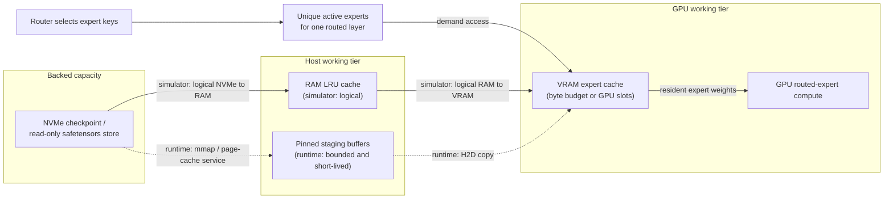
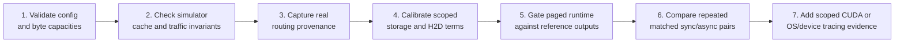

# Memory ledger: tiers, traffic and evidence

MoEVM Lab treats sparse expert weights as a working set, not as one block that
must always reside in GPU memory.  This page describes the project-owned
memory model and the evidence needed to turn a byte counter into a hardware
claim.

It is deliberately a ledger rather than a promise of speed: a cache can reduce
blocking work while increasing total movement.  Capacity, logical traffic and
physical device traffic are different quantities and must be reported
separately.

## The expert-weight path



The diagram intentionally shows two implementations of the host path:

- The **simulator** models an inclusive, byte-capacity RAM LRU below its VRAM
  LRU.  NVMe is an implicit backing store containing all experts.
- The current **paged OLMoE runtime** obtains expert tensors through a
  read-only safetensors mmap, services them with one bounded I/O worker by
  default, copies them through pinned CPU staging buffers, then places them
  into bounded GPU slots. It does not yet implement a persistent pinned-RAM
  expert cache.

Both paths use the same useful abstraction: an expert is addressed by
`(layer_id, expert_id)` and only selected, non-resident experts need weight
movement.  They do not make the same claim about the operating system or the
storage device.

## What is resident, and what is only a transfer path

| Tier | Simulator | Current paged OLMoE runtime | Important boundary |
|---|---|---|---|
| NVMe backing store | Implicit source for every expert payload | Read-only checkpoint shards accessed through mmap | A runtime request may be served by the OS page cache rather than a physical SSD read. |
| Host RAM | Inclusive, byte-capacity LRU of logical expert payloads | OS-managed mapped pages may be present, but MoEVM does not present them as a controlled persistent expert cache | OS page-cache residency is not measured by the normal runtime counters. |
| Pinned host staging | Not a separate simulator tier | A small bounded set of temporary CUDA-pinned buffers | Staging capacity is a transfer buffer, not the RAM expert-cache capacity used by the simulator. |
| VRAM expert cache | Demand LRU plus an optional protected speculative partition | Bounded per-layer GPU expert slots with lifetime/lease protection | This covers paged expert weights, not the entire model, activations, attention state, or KV cache. |
| GPU compute | Configured compute budget in simulation | Actual routed-expert execution for the supported OLMoE path | Expert residency alone does not characterize end-to-end model performance. |

Evicting a working copy does not write expert weights back to NVMe: the
checkpoint remains the read-only source of truth.  An eviction discards a
reconstructable cache entry and may invalidate dependent copies according to
the cache policy.

## Per-routed-expert movement

Routing is sparse, but `top_k` is not automatically equal to the number of
payload transfers.  Several tokens in the same routed layer can select the
same expert, so MoEVM deduplicates active expert IDs before the paged runtime
loads them.  A VRAM hit also moves no expert-weight payload.

For a distinct demanded expert, the ledger is:

| Location before demand | Simulator accounting | Runtime interpretation | Expert-weight payload movement |
|---|---|---|---|
| VRAM cache | L1 hit | GPU slot already holds the expert | None |
| RAM cache only | L2 hit | No direct equivalent to a persistent user-controlled RAM expert cache yet | One logical RAM to VRAM payload in the simulator |
| NVMe backing only | Storage hit | Safetensors service can resolve from mapped RAM, a page fault, or a mixture | One logical NVMe to RAM payload plus one logical RAM to VRAM payload in the simulator; the runtime stages and H2D-copies a missing GPU expert |
| Speculatively loaded expert | Useful prefetch when later demanded | Same eventual GPU-slot hit after the scheduled load completes | Movement occurred earlier; it must still be counted, even if it avoids a demand stall |

The optional predictor can schedule payload movement before demand.  Its VRAM
partition is protected so inaccurate speculative entries do not take over the
whole demand cache.  A prefetch may be useful, late, rejected, or wasted;
traffic counters and predictor statistics are therefore necessary alongside
wall time.

## Logical bytes are not physical bytes

**Logical bytes** are bytes accounted for by MoEVM's cache or runtime model.
For example, when a configured expert is absent from the simulator's RAM and
VRAM caches, the simulator adds that expert payload to both the `NVMe -> RAM`
and `RAM -> VRAM` logical paths.  The configured payload size and cache state
make this repeatable across policies and traces.

**Physical bytes** are bytes actually read from an SSD, passed through PCIe,
or transferred by a device engine during a particular run.  They require
device- or operating-system-level attribution.  They can differ from a logical
ledger because of OS page caching, mmap faults, readahead, tensor layout,
batching, coalescing, transfer granularity, compression or driver behavior.

Consequences for reporting:

- `NVMe -> RAM` and `RAM -> VRAM` totals in simulator reports are **logical
  model traffic**, not a disk or PCIe trace.
- Runtime miss, storage-load and host-to-device counters describe the MoEVM
  data path and are useful pair-comparison invariants.  By themselves, they do
  not prove a physical SSD read, queue depth, bus utilization or temporal
  overlap.
- The storage and CUDA calibration harnesses measure their own scoped
  microbenchmarks.  Those measurements can parameterize an experiment, but
  cannot retrospectively identify the physical source of every runtime load.
- CUDA-event telemetry can provide same-device evidence for the instrumented
  H2D and paged-expert-compute intervals.  A physical NVMe-overlap claim still
  needs separate OS/device tracing or a future direct-I/O backend.

This distinction is especially important for an "empty" GPU expert cache.
It means the dynamic GPU slots start empty; it does **not** mean the operating
system's page cache or the SSD is cold.

## Capacity ledger versus flow ledger

A capacity ledger answers *what can stay resident at once*.  A flow ledger
answers *what was moved over a workload*.  The latter can be much larger than
the former because an expert may be evicted and loaded again on later routed
layers or tokens.

For the simulator, cache capacity is configured in bytes and divided by the
configured average expert payload to derive the number of whole expert slots.
`moevm doctor` validates this configuration and displays those calculated
capacities. Its optional `--machine` mode also makes **read-only, best-effort**
observations of host RAM, the selected path's volume and NVIDIA GPUs via
`nvidia-smi`; it does not open a CUDA context, inspect a checkpoint, prove
physical disk traffic, or establish that an arbitrary model fits.

```powershell
moevm doctor --config configs\k3_shape.toml --machine --cache-path D:\MoEVM-cache
```

The command keeps observed machine capacity separate from the configured
logical ledger. `--json` is available only with `--machine`, and
`--no-gpu-probe` avoids calling `nvidia-smi` where even that read-only probe is
undesired.

The shipped `configs/k3_shape.toml` is a **synthetic topology experiment**.  It
uses Kimi K3's published layer/expert/top-k shape, but its average expert
payload, compute time, storage layout and transfer behavior are placeholders.
It does not load, execute, benchmark, or imply compatibility with Kimi K3
weights.  See [K3 notes](K3_NOTES.md) for the adapter work that would be
required before a real checkpoint could enter this ledger.

## Validation ladder

The ledger becomes stronger one rung at a time.  Later rungs do not erase the
limits of earlier ones.



1. **Configuration and capacity.** Validate model shape, expert payload,
   cache budgets, and latency assumptions.  This establishes an experiment;
   it does not validate a checkpoint or a machine.
2. **Simulator invariants.** Compare baseline and candidate on the same trace,
   then report stalls, hit rates, logical bytes, prefetch precision and
   rejection reasons together.
3. **Routing provenance.** Capture router decisions from a pinned real model
   and retain trace hashes, revision, workload and environment metadata.
4. **Scoped calibration.** Measure storage and H2D behavior independently,
   then state exactly where those measurements are used in replay or runtime
   decisions.
5. **Runtime correctness.** Run the bounded paged implementation against a
   fixed reference and reject a result if token or required numerical identity
   fails.
6. **Paired performance.** Keep checkpoint, workload, cache budget, pipeline
   settings and evidence policy identical; use repeated pairs and preserve the
   logical cache/transfer counters that make the comparison auditable.
7. **Hardware attribution.** Use scoped CUDA-event timing for H2D/compute
   evidence and use OS/device tracing for a physical storage claim.  Neither is
   implied by a Python queue, a cache hit rate, or a single wall-time result.

The current implementation has evidence at several rungs for the supported
OLMoE path.  It is still pre-alpha research software: a positive result at one
rung is permission for the next experiment, not a general serving claim.

## Reading a MoEVM result responsibly

When reviewing a chart or report, ask these five questions:

1. Is this simulation, routing capture, trace replay, microbenchmark, or
   end-to-end execution?
2. Which bytes are logical counters, and which are independently measured
   physical traffic?
3. Was the same trace, cache budget, checkpoint and machine used for the
   comparison?
4. Is the observed state a cold dynamic GPU cache, a retained GPU cache, or an
   uncontrolled OS page-cache state?
5. Did correctness, cache/traffic invariants and repeated measurements pass
   before a speed conclusion was drawn?

For the project-wide labels and required metrics, see
[Benchmarking rules](BENCHMARKING.md).  For the asynchronous runtime lifecycle
and telemetry boundary, see [Async expert pipeline](ASYNC_PIPELINE.md).
