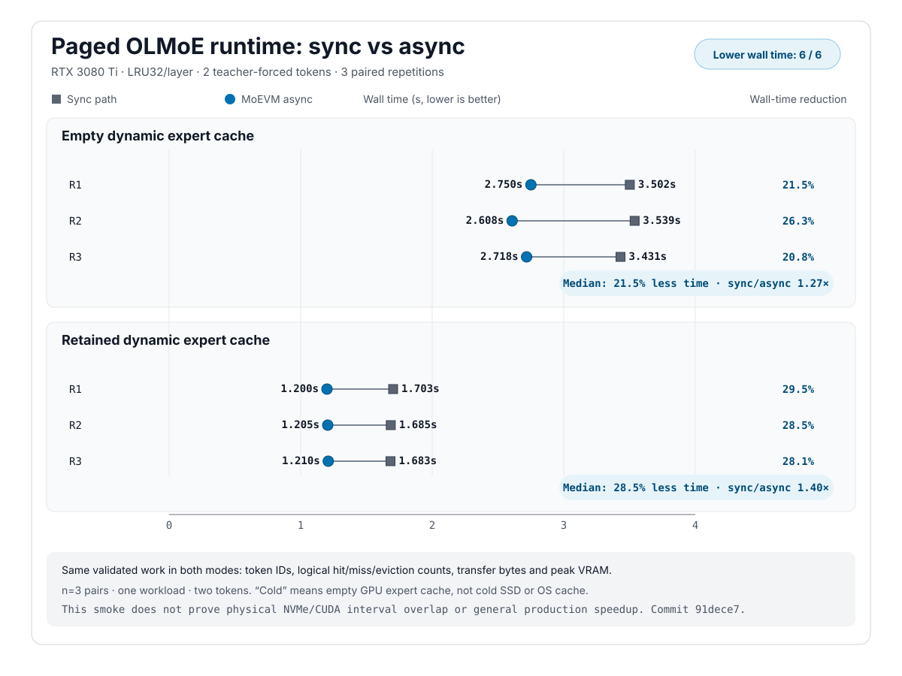

# MoEVM Lab — panoramica italiana

MoEVM Lab è un progetto di ricerca per capire se gli expert di un modello MoE enorme possano essere gestiti come una gerarchia di memoria:

```text
VRAM: expert necessari subito
RAM: expert probabili o recenti
NVMe: archivio completo dei pesi
```

La release 0.3 è un laboratorio eseguibile, non un runtime di Kimi K3. Genera
routing trace sintetici, cattura routing da un piccolo MoE reale e confronta
una cache LRU normale con un prefetch predittivo. Include calibrazione hardware
e un primo runtime paginato sincrono per il piccolo OLMoE. Lo sviluppo non
ancora rilasciato aggiunge un percorso asincrono opzionale e limitato. Il
laboratorio misura:

- hit-rate VRAM e RAM;
- byte NVMe→RAM e RAM→VRAM;
- tempo bloccante di demand e prefetch;
- precisione del predictor;
- throughput stimato dal modello temporale configurato.

Il demo incluso ottiene un vantaggio sintetico, ma mostra anche più traffico PCIe. Questo è utile perché impedisce di presentare come innovazione un algoritmo che sposta soltanto il costo da una metrica all'altra.

## Stato v0.3

La milestone M1 è completata su `allenai/OLMoE-1B-7B-0924`: 10 trace reali,
438 token e 56.064 accessi agli esperti, con revisione del modello e hash dei
trace registrati. Il routing reale mostra il 44,09% di sovrapposizione temporale
media. Il replay simulato è quasi neutro (1,0022×) e aumenta il traffico
RAM→VRAM del 6,17%: è un risultato negativo utile, perché indica che il predictor
va migliorato prima di costruire il runtime.

Le decisioni del router sono misurate sul modello reale; lo speedup M1, gli
stall e il traffico del replay restano simulati.

## Evidenza M2/M3

Il nuovo P310 M.2 misura `6,04 GB/s + 299 us` nel fit delle letture casuali da
12 MiB, contro `1,84 GB/s + 465 us` del vecchio P2. Il trasferimento pinned
RAM→VRAM misura `13,00 GB/s + 22,3 us`. Con questo profilo il predictor attuale
ottiene `0,9791x` sui dieci trace reali: circa il 2,09% più lento e con il 4,91%
di traffico RAM→VRAM in più. Quindi l'SSD migliore è utile per il paging, ma non
rende automaticamente buono il prefetch.

È stato anche eseguito il primo smoke completo del runtime paginato sul modello
OLMoE reale. Con 32 slot per layer, i due token generati coincidono con il
riferimento CPU-offload. La memoria GPU allocata di picco scende da 8,770 a
6,899 GiB (−21,34%). Il passaggio con cache expert vuota è più lento (`0,677x`),
mentre la ripetizione che conserva la cache arriva a `1,372x`. È un segnale di
fattibilità, non un claim generale: c'è un solo prompt, due token generati, un
solo intervallo decode e la cache del sistema operativo non è controllata.

Nel ramo di sviluppo esiste ora anche un MVP asincrono opzionale: un worker di
lettura, almeno due buffer pinned, uno stream CUDA H2D e eventi che proteggono
gli slot GPU. Il primo confronto controllato usa tre coppie contro il percorso
sincrono, alternando l'ordine. A parità esatta di token, hit/miss, traffico e
VRAM, l'async usa meno tempo in tutte le coppie: mediana `1,274x` con cache
expert GPU vuota e `1,398x` nella ripetizione che conserva la cache.



È uno smoke provvisorio con un prompt e due token, non un claim generale. La
lettura resta mmap/page-cache e manca una timeline comune degli eventi CUDA:
il risultato non dimostra ancora overlap fisico dell'SSD o sovrapposizione
temporale H2D/kernel. [Dati, grafico e limiti](../benchmarks/reference/paged-runtime-olmoe-p310-async-smoke/README.md).

## Avvio rapido

La demo sul modello OLMoE reale si avvia con un solo comando su Windows:

```powershell
.\demo.cmd
```

Il comando rileva GPU, VRAM, RAM e cache; prepara un ambiente Python isolato,
scarica solo se necessario la revisione fissata del modello, verifica gli hash,
sceglie automaticamente una cache GPU sicura e mostra tempo, token/s, picco
VRAM e working set del processo. La modalità predefinita usa il percorso async;
`.\demo.cmd -Compare` aggiunge il confronto locale sync/async. Il primo avvio
può richiedere circa 13 GiB di modello e alcuni GiB di dipendenze. È una demo
hardware fino a due token, non un benchmark generale. Dettagli e limiti sono in
[Demo OLMoE con un comando](ONE_COMMAND_DEMO.md).

La simulazione senza modello/GPU resta disponibile con:

```powershell
powershell -ExecutionPolicy Bypass -File .\scripts\bootstrap.ps1
```

## Obiettivo successivo

La prossima mossa seria non è K3: è estendere il confronto sync/async dai due
token a generazioni più lunghe e ai cinque workload, poi misurare con
eventi/profiler se copie H2D e kernel si sovrappongono davvero. Per dimostrare
anche l'overlap con l'SSD fisico servirà tracing del sistema operativo o un
futuro backend direct-I/O.

## Licenza

Il codice e la documentazione di proprietà del progetto sono distribuiti con
licenza Apache 2.0; v0.3.0 è la prima release preparata con questa licenza.
Modelli, pesi, output derivati e strumenti di terze parti
mantengono le rispettive licenze; nessun peso del modello è incluso nel
repository. I vecchi tag e gli archivi già distribuiti mantengono invece la
licenza presente al momento della loro pubblicazione.
